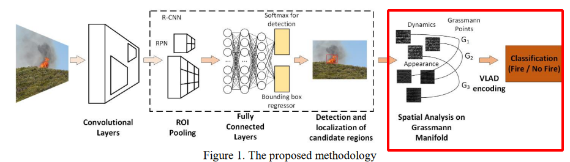

# The Forest Fire Conference

- **[chen2018ua](chen2018uav.pdf)**

  ```bibtex
  @inproceedings{chen2018uav,
    title={A UAV-based forest fire detection algorithm using convolutional neural network},
    author={Chen, Yanhong and Zhang, Youmin and Xin, Jing and Yi, Yingmin and Liu, Ding and Liu, Han},
    booktitle={2018 37th Chinese Control Conference (CCC)},
    pages={10305--10310},
    year={2018},
    organization={IEEE},
    doi={10.23919/ChiCC.2018.8484035}
  }
  ```

  - **Keywords:** Forest Fire Detection, Convolutional Neural Network, Unmanned Aerial Vehicle
  - **Abstract:** classification with cnn, implementation with DJI S900 + Sony A7
  - **Note:** simple cnn

---

- **[chen2019uav](chen2019uav.pdf)**

  ```bibtex
  @inproceedings{chen2019uav,
  title={UAV image-based forest fire detection approach using convolutional neural network},
  author={Chen, Yanhong and Zhang, Youmin and Xin, Jing and Wang, Guangyi and Mu, Lingxia and Yi, Yingmin and Liu, Han and Liu, Ding},
  booktitle={2019 14th IEEE conference on industrial electronics and applications (ICIEA)},
  pages={2118--2123},
  year={2019},
  organization={IEEE},
  doi={10.1109/ICIEA.2019.8833958}
  }
  ```

  - **Keywords:** Forest Fire Detection (FFD), Convolutional Neural Network (CNN),Unmanned Aerial Vehicles (UAVs), Local Binary Pattern (LBP), Image Preprocessing
  - **Abstract:** LBP+SVM and CNN
  - **Note:** simple CNN

---

- **[kyrkou2019deep](kyrkou2019deep.pdf)**

  ```bibtex
  @inproceedings{kyrkou2019deep,
    title={Deep-Learning-Based Aerial Image Classification for Emergency Response Applications Using Unmanned Aerial Vehicles.},
    author={Kyrkou, Christos and Theocharides, Theocharis},
    booktitle={CVPR Workshops},
    pages={517--525},
    year={2019}
  }
  ```

  - **Keywords:** CNN, diaster classify
  - **Abstract:**
  - **Note:**
    - implementation:
    - using many CNNs:
    - attention-like results:

---

- **[jiao2019deep](jiao2019deep.pdf)**

  ```bibtex
  @inproceedings{jiao2019deep,
  title={A deep learning based forest fire detection approach using UAV and YOLOv3},
  author={Jiao, Zhentian and Zhang, Youmin and Xin, Jing and Mu, Lingxia and Yi, Yingmin and Liu, Han and Liu, Ding},
  booktitle={2019 1st International Conference on Industrial Artificial Intelligence (IAI)},
  pages={1--5},
  year={2019},
  organization={IEEE},
  doi={10.1109/ICIAI.2019.8850815}
  }
  ```

  - **Keywords:** UAV, yolov3
  - **Abstract:** <++>
  - **Note:**
    - calculate onboard.
    - platform:

---

- **[jiao2020yolov3](jiao2020yolov3.pdf)**

  ```bibtex
  @inproceedings{jiao2020yolov3,
  title={A YOLOv3-based Learning Strategy for Real-time UAV-based Forest Fire Detection},
  author={Jiao, Zhentian and Zhang, Youmin and Mu, Lingxia and Xin, Jing and Jiao, Shangbin and Liu, Han and Liu, Ding},
  booktitle={2020 Chinese Control And Decision Conference (CCDC)},
  pages={4963--4967},
  year={2020},
  organization={IEEE},
  doi={10.1109/CCDC49329.2020.9163816}
  }
  ```

  - **Keywords:**
  - **Abstract:**
  - **Note:**
    - calculate on ground station.
    - concept:

---

- **[kinaneva2019early](kinaneva2019early.pdf)**

  ```bibtex
  @inproceedings{kinaneva2019early,
  title={Early forest fire detection using drones and artificial intelligence},
  author={Kinaneva, Diyana and Hristov, Georgi and Raychev, Jordan and Zahariev, Plamen},
  booktitle={2019 42nd International Convention on Information and Communication Technology, Electronics and Microelectronics (MIPRO)},
  pages={1060--1065},
  year={2019},
  organization={IEEE},
  doi={10.23919/MIPRO.2019.8756696}
  }
  ```

  - **Keywords:** early forest fire detection platform, drones, UAVs, artificial intelligence, computer vision
  - **Abstract:** <++>
  - **Note:** <++>
    - AI methods:
    - platform: DJIM210; ALTi Transition VTOL aircraft(UAV) with NightHawk 2 camera

---

- **[hossain2021development](hossain2021development.pdf)**

  ```bibtex
  @inproceedings{hossain2021development,
  title={Development of New Efficient Transposed Convolution Techniques for Flame Segmentation from UAV-captured Images},
  author={Hossain, FM Anim and Zhang, Youmin},
  booktitle={2021 3rd International Conference on Industrial Artificial Intelligence (IAI)},
  pages={1--6},
  year={2021},
  organization={IEEE}
  }
  ```

  - **Keywords:** upsmapling network, UAV, image segmentation
  - **Abstract:**
  - **Note:** need to read further and checkout the unet...

---

- **[sherstjuk20203d](sherstjuk20203d.pdf)**

  ```bibtex
  @inproceedings{sherstjuk20203d,
    title={3D Fire Front Reconstruction in UAV-Based Forest-Fire Monitoring System},
    author={Sherstjuk, Vladimir and Zharikova, Maryna and Dorovskaja, Irina},
    booktitle={2020 IEEE Third International Conference on Data Stream Mining \& Processing (DSMP)},
    pages={243--248},
    year={2020},
    organization={IEEE},
    doi={10.1109/DSMP47368.2020.9204196}
  }
  ```

  - **Keywords:** <++>
  - **Abstract:** use the motion of the drone to get the *baseline* get the depeth and use the OctoMap Tree to reconstruct
  fire.
  - **Note:**
    - reconstruct sense:
    - forest fire font reconstruction result:

---

- **[barmpoutis2019fire](barmpoutis2019fire.pdf)**

  ```bibtex
  @inproceedings{barmpoutis2019fire,
    title={Fire detection from images using faster R-CNN and multidimensional texture analysis},
    author={Barmpoutis, Panagiotis and Dimitropoulos, Kosmas and Kaza, Kyriaki and Grammalidis, Nikos},
    booktitle={ICASSP 2019-2019 IEEE International Conference on Acoustics, Speech and Signal Processing (ICASSP)},
    pages={8301--8305},
    year={2019},
    organization={IEEE},
    doi={10.1109/ICASSP.2019.8682647}}
  }
  ```

  - **Keywords:** Image-based fire detection, Convolutional Neural Networks, Spatial texture analysis, Linear Dynamical Systems.
  - **Abstract:** using the Faster-RCNN + Spatial texture analysis to detect the fire.
  - **Note:**
    - methodology:
    - about the CNN:

---

- **[moffatt2021collaboration](moffatt2021collaboration.pdf)**

  ```bibtex
  @inproceedings{moffatt2021collaboration,
  title={Collaboration between Multiple UAVs for Fire Detection and Suppression},
  author={Moffatt, Andrew and Turcios, Nicholas and Edwards, Chase and Karnik, Atharva and Kim, David and Kleinman, Andrew and Nguyen, Vincent and Ramos, Victor and Ranario, Earvin and Sato, Tomo and others},
  booktitle={2021 International Conference on Unmanned Aircraft Systems (ICUAS)},
  pages={730--737},
  year={2021},
  organization={IEEE},
  doi={10.1109/ICUAS51884.2021.9476715}
  }
  ```

  - **Keywords:** <++>
  - **Abstract:** <++>
  - **Note:** <++>
    - about the conference: ICUAS 2021
    - use the Lidar to avoid obstacles
    - use the altitude as the **depth**
    - use the threshold method to detect fire ONLY with thermal image.
    - platform: M600 + Intel NUC + VLP-16 Punk lite LiDAR + IR sensor.
    - results:

---

- **[yuan2017fire](yuan2017fire.pdf)**

  ```bibtex
  @inproceedings{yuan2017fire,
  title={Fire detection using infrared images for UAV-based forest fire surveillance},
  author={Yuan, Chi and Liu, Zhixiang and Zhang, Youmin},
  booktitle={2017 International Conference on Unmanned Aircraft Systems (ICUAS)},
  pages={567--572},
  year={2017},
  organization={IEEE},
  doi={10.1109/ICUAS.2017.7991306}
  }
  ```

  - **Keywords:** <++>
  - **Abstract:**
    - Ir image
    - traditional Otsu segmentation
    - Motion detection using optical flow
  - **Note:**
    - Otsu method:
      > 大津法, 二分阈值方法
    - result:

---

- **[sadi2021forest](sadi2021forest.pdf)**

  ```bibtex
  @inproceedings{sadi2021forest,
  title={Forest Fire Detection and Localization Using Thermal and Visual Cameras},
  author={Sadi, Mohsen and Zhang, Youmin and Xie, Wen-Fang and Hossain, FM Anim},
  booktitle={2021 International Conference on Unmanned Aircraft Systems (ICUAS)},
  pages={744--749},
  year={2021},
  organization={IEEE},
  doi={10.1109/ICUAS51884.2021.9476865}
  }
  ```

  - **Keywords:**
  - **Abstract:**
    1. thermal iamge threshold
    2. color space segmentation RGB
    3. homography matrix for the alignment withouut the depth
  - **Note:**
    - segmentation result:
    - the alignment:

---

- **[yuan2015uav](yuan2015uav.pdf)**

  ```bibtex
  @inproceedings{yuan2015uav,
  title={UAV-based forest fire detection and tracking using image processing techniques},
  author={Yuan, Chi and Liu, Zhixiang and Zhang, Youmin},
  booktitle={2015 International Conference on Unmanned Aircraft Systems (ICUAS)},
  pages={639--643},
  year={2015},
  organization={IEEE},
  doi={10.1109/ICUAS.2015.7152345}
  }
  ```

  - **Keywords:**
  - **Abstract:**
    - color space
    - Ostu segmentation
    - morphological operations(opening and closing)
  - **Note:**
    - result: 

---

- **[yuan2017aerial](yuan2017aerial.pdf)**

  ```bibtex
  @article{yuan2017aerial,
  title={Aerial images-based forest fire detection for firefighting using optical remote sensing techniques and unmanned aerial vehicles},
  author={Yuan, Chi and Liu, Zhixiang and Zhang, Youmin},
  journal={Journal of Intelligent \& Robotic Systems},
  volume={88},
  number={2},
  pages={635--654},
  year={2017},
  publisher={Springer},
  url={https://doi.org/10.1007/s10846-016-0464-7},
  doi={10.1007/s10846-016-0464-7}
  }
  ```

  - **Keywords:** <++>
  - **Abstract:** <++>
  - **Note:**
    - optical flow methodology:
    - motion based fireflame tracking:

---

- **[yuan2019learning](yuan2019learning.pdf)**

  ```bibtex
  @article{yuan2019learning,
  title={Learning-based smoke detection for unmanned aerial vehicles applied to forest fire surveillance},
  author={Yuan, Chi and Liu, Zhixiang and Zhang, Youmin},
  journal={Journal of Intelligent \& Robotic Systems},
  volume={93},
  number={1-2},
  pages={337--349},
  year={2019},
  publisher={Springer Nature BV},
  doi={10.1007/s10846-018-0803-y},
  url={https://doi.org/10.1007/s10846-018-0803-y}
  }
  ```

  - **Keywords:** <++>
  - **Abstract:** <++>
  - **Note:**
    - not really understanding this paper...
      1. **Need to learn the Fuzzy logic**
      2. figure out the function of EKF
    - smoke segmentation methodology:
    - fuzzy logic:

---

- TODO: **[sherstjuk2018forest](sherstjuk2018forest.pdf)**

  ```bibtex
  @inproceedings{sherstjuk2018forest,
  title={Forest fire-fighting monitoring system based on UAV team and remote sensing},
  author={Sherstjuk, Vladimir and Zharikova, Maryna and Sokol, Igor},
  booktitle={2018 IEEE 38th International Conference on Electronics and Nanotechnology (ELNANO)},
  pages={663--668},
  year={2018},
  organization={IEEE},
  doi={10.1109/IAI53119.2021.9619442}
  }
  ```

  - **Keywords:** <++>
  - **Abstract:** <++>
  - **Note:** <++>

---

- TODO: **[dai2020smoke](dai2020smoke.pdf)**

  ```bibtex
  @inproceedings{dai2020smoke,
  title={Smoke detection in infrared images based on superpixel segmentation},
  author={Dai, Min and Gao, Peng and Sha, Mozhou and Tian, Jinwen},
  booktitle={MIPPR 2019: Remote Sensing Image Processing, Geographic Information Systems, and Other Applications},
  volume={11432},
  pages={1143213},
  year={2020},
  organization={International Society for Optics and Photonics},
  doi = {10.1117/12.2538195},
  url = {https://doi.org/10.1117/12.2538195}
  }
  ```

  - **Keywords:** <++>
  - **Abstract:** <++>
  - **Note:** <++>

---
