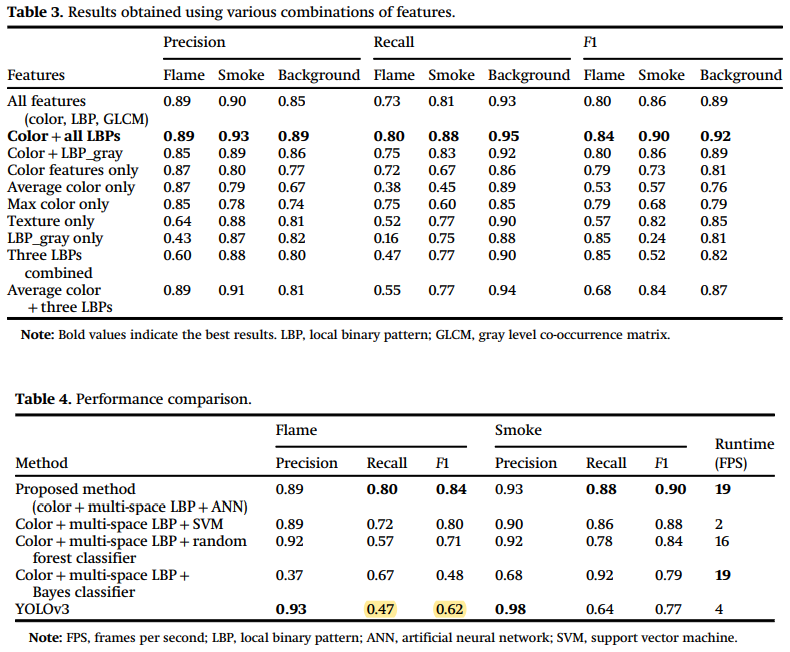
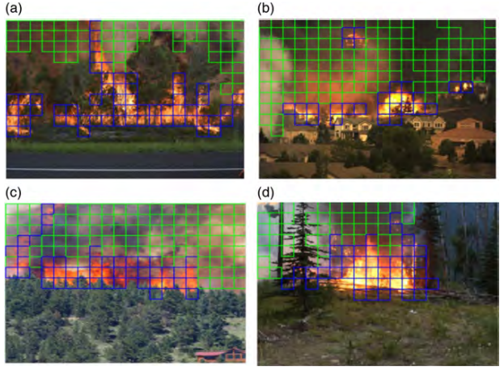
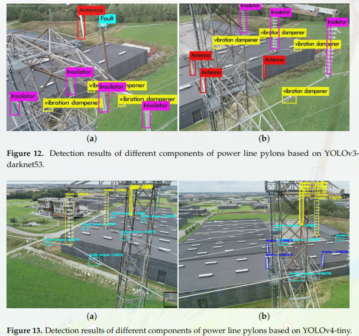
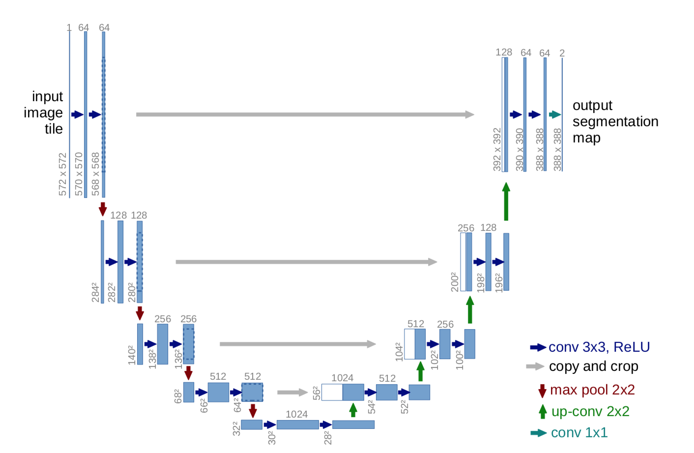
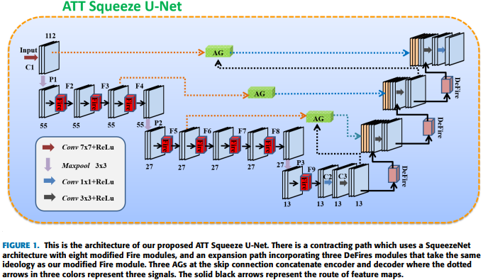
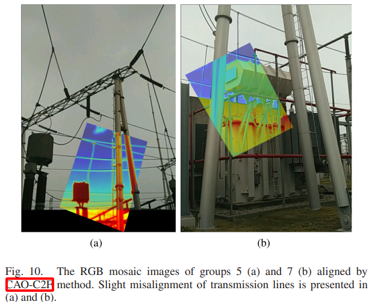
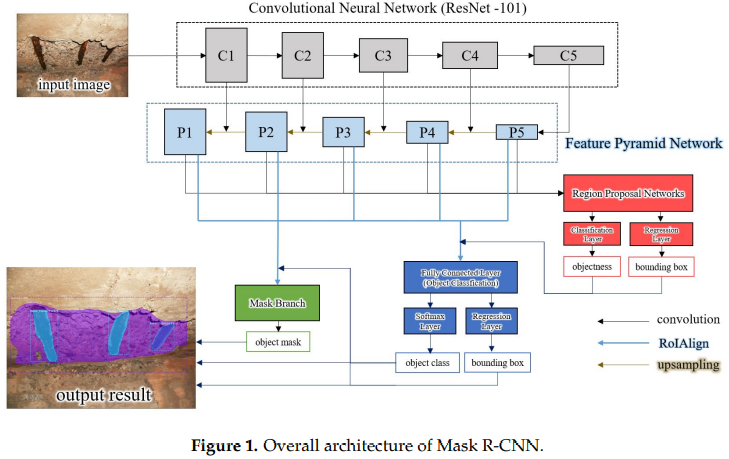
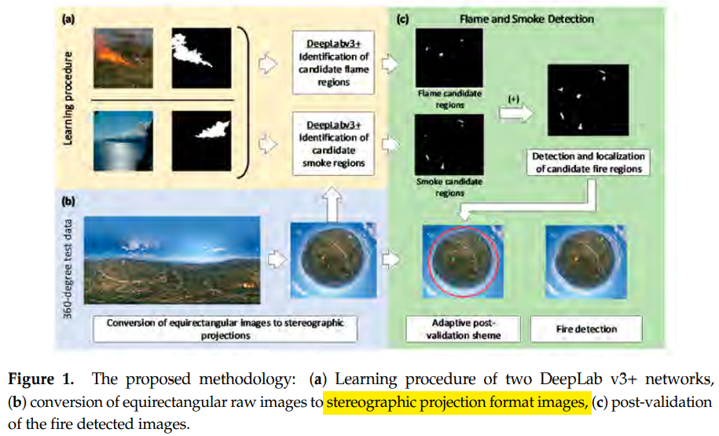
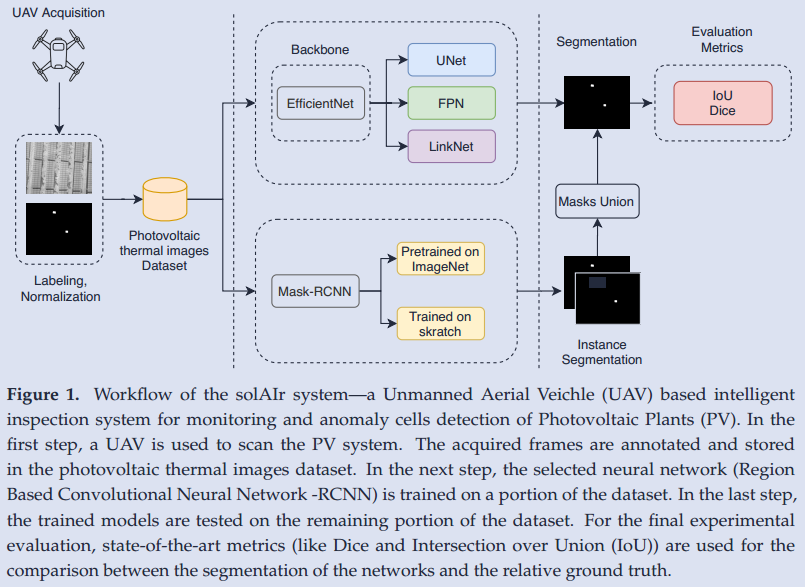
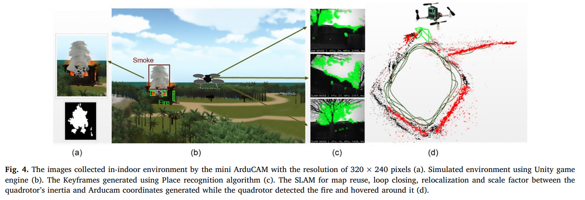

# The Forest Fire Journal & Letter

- **[hossain2020forest](hossain2020forest.pdf)**

  ```bibtex
    @article{hossain2020forest,
    title={Forest fire flame and smoke detection from UAV-captured images using fire-specific color features and multi-color space local binary pattern},
    author={Hossain, FM Anim and Zhang, Youmin M and Tonima, Masuda Akter},
    journal={Journal of Unmanned Vehicle Systems},
    volume={8},
    number={4},
    pages={285--309},
    year={2020},
    publisher={Canadian Science Publishing 1840 Woodward Drive, Suite 1, Ottawa, ON K2C 0P7}
    doi = {10.1139/juvs-2020-0009},
    url={https://doi.org/10.1139/juvs-2020-0009}
    }
  ```

  - **Keywords:** forest fire detection, unmanned aerial vehicles, artificial neural network, flame and smoke detection, remote sensing
  - **Abstract:** Using the color spaces features with ANN and ML algorithms
  - **Note:** use the ANN and ML to claissfy the "patches" from one picture based on the hunman-defined features.
    - methods: 
    - results: 

---

- **[ayoub2021real](ayoub2021real.pdf)**
  
  ```bibtex
  @article{ayoub2021real,
  title={Real-Time On-Board Deep Learning Fault Detection for Autonomous UAV Inspections},
  author={Ayoub, Naeem and Schneider-Kamp, Peter},
  journal={Electronics},
  volume={10},
  number={9},
  pages={1091},
  year={2021},
  publisher={Multidisciplinary Digital Publishing Institute},
  url={https://doi.org/10.3390/electronics10091091}
  }
  ```

  - **Keywords:** UAV, object detection, yolov4-tiny
  - **Abstract:** <++>
  - **Note:** 3区, open access
    - paltform: Rasperry Pi 4, TX2, Jetson Nano, Jetson AGX Xavier
    - Use the tensorRT
    - method: yolov4-tiny
    - results: 

---

- **[shihavuddin2019wind](shihavuddin2019wind.pdf)**
  
  ```bibtex
  @article{shihavuddin2019wind,
  title={Wind turbine surface damage detection by deep learning aided drone inspection analysis},
  author={Shihavuddin, ASM and Chen, Xiao and Fedorov, Vladimir and Nymark Christensen, Anders and Andre Brogaard Riis, Nicolai and Branner, Kim and Bjorholm Dahl, Anders and Reinhold Paulsen, Rasmus},
  journal={Energies},
  volume={12},
  number={4},
  pages={676},
  year={2019},
  publisher={Multidisciplinary Digital Publishing Institute}
  }
  ```

  - **Keywords:** <++>
  - **Abstract:** <++>
  - **Note:** <++>

---

- **[zhang2021att](zhang2021att.pdf)**
  
  ```bibtex
  @article{zhang2021att,
  title={ATT Squeeze U-Net: A Lightweight Network for Forest Fire Detection and Recognition},
  author={Zhang, Jianmei and Zhu, Hongqing and Wang, Pengyu and Ling, Xiaofeng},
  journal={IEEE Access},
  volume={9},
  pages={10858--10870},
  year={2021},
  publisher={IEEE},
  doi={10.1109/ACCESS.2021.3050628}
  }
  ```

  - **Keywords:** <++>
  - **Abstract:** refined u-net for the foreset fire flame segmentation
  - **Note:**
      > The U-Net is a convolutional neural network that was developed for biomedical image segmentation at the Computer
      > Science Department of the University of Freiburg, Germany. The network is based on the fully convolutional
      > network and its architecture was modified and extended to work with fewer training images and to yield more
      > precise segmentations.
      >
    - Pure Unet for smoke detection: [github](https://github.com/rekon/Smoke-semantic-segmentation)
    - Pure Unet structure: 
    - ATT-Squeeze u-net structure: 
    - some network structure is very confusing to implement

---

- **[jiang2020contour](jiang2020contour.pdf)**
  
  ```bibtex
  @article{jiang2020contour,
  title={A contour angle orientation for power equipment infrared and visible image registration},
  author={Jiang, Qian and Liu, Yadong and Yan, Yingjie and Deng, Jun and Fang, Jian and Li, Zhe and Jiang, Xiuchen},
  journal={IEEE Transactions on Power Delivery},
  volume={36},
  number={4},
  pages={2559--2569},
  year={2020},
  publisher={IEEE},
  doi={10.1109/TPWRD.2020.3011962}
  }
  ```

  - **Keywords:** <++>
  - **Abstract:** come up with a new feature and descriptor to align the Thermal Image and RGB image in the field of
  power equipment.
  - **Note:**
    - result: 

---

- **[kim2020automated](kim2020automated.pdf)**
  
  ```bibtex
  @article{kim2020automated,
  title={Automated multiple concrete damage detection using instance segmentation deep learning model},
  author={Kim, Byunghyun and Cho, Soojin},
  journal={Applied Sciences},
  volume={10},
  number={22},
  pages={8008},
  year={2020},
  publisher={Multidisciplinary Digital Publishing Institute},
  doi = {10.3390/app10228008}
  }
  ```

  - **Keywords:** mask-RCNN, Instance segmentation, concrete damage
  - **Abstract:** <++>
  - **Note:** <++>
    - mask-RCNN network: 

---

- **[barmpoutis2020early](barmpoutis2020early.pdf)**
  
  ```bibtex
  @article{barmpoutis2020early,
  title={Early fire detection based on aerial 360-degree sensors, deep convolution neural networks and exploitation of fire dynamic textures},
  author={Barmpoutis, Panagiotis and Stathaki, Tania and Dimitropoulos, Kosmas and Grammalidis, Nikos},
  journal={Remote Sensing},
  volume={12},
  number={19},
  pages={3177},
  year={2020},
  publisher={Multidisciplinary Digital Publishing Institute},
  doi = {10.3390/rs12193177}
  }
  ```

  - **Keywords:** <++>
  - **Abstract:** <++>
  - **Note:** <++>
    - methodology: 
    - 1. 360 camera
    - 2. DeepLab V3+
    - 3. post-validation adaptive method to reduce the false-positive rate

---

- **[pierdicca2020automatic](pierdicca2020automatic.pdf)**
  
  ```bibtex
  @article{pierdicca2020automatic,
  title={Automatic Faults Detection of Photovoltaic Farms: solAIr, a Deep Learning-Based System for Thermal Images},
  author={Pierdicca, Roberto and Paolanti, Marina and Felicetti, Andrea and Piccinini, Fabio and Zingaretti, Primo},
  journal={Energies},
  volume={13},
  number={24},
  pages={6496},
  year={2020},
  publisher={Multidisciplinary Digital Publishing Institute},
  doi = {10.3390/en13246496}
  }
  ```

  - **Keywords:** <++>
  - **Abstract:** segmentation on the thermal image.
  - **Note:**
    - methodology 

---

- **[de2020aerial](de2020aerial.pdf)**
  
  ```bibtex
  @article{de2020aerial, 
  title={Aerial Forest Fire Detection and Monitoring Using a Small UAV}, 
  author={Vasconcelos Reinolds de Sousa , Joaquim and Vieira Gamboa, Pedro},
  volume={5}, 
  url={https://knepublishing.com/index.php/KnE-Engineering/article/view/7038}, 
  DOI={10.18502/keg.v5i6.7038}, 
  number={6}, 
  journal={KnE Engineering}, 
  year={2020},
  month={Jun.},
  pages={242–256}
  }
  ```

  - **Keywords:** detecting and localization of the wild fire.
  - **Abstract:** <++>
  - **Note:**
    - tradition color space methods to detect the fire.
    - use the altitude as the deepth calculate the fire geolocation.
    - the translation between the pixel and NED(of global location):
    - the fire position is the *gravity center* of the segmentation.

---

- **[esfahlani2019mixed](esfahlani2019mixed.pdf)**
  
  ```bibtex
  @article{esfahlani2019mixed,
  title={Mixed reality and remote sensing application of unmanned aerial vehicle in fire and smoke detection},
  author={Esfahlani, Shabnam Sadeghi},
  journal={Journal of Industrial Information Integration},
  volume={15},
  pages={42--49},
  year={2019},
  publisher={Elsevier},
  issn = {2452-414X},
  doi = {https://doi.org/10.1016/j.jii.2019.04.006},
  url = {https://www.sciencedirect.com/science/article/pii/S2452414X18300773},
  }
  ```

  - **Keywords:** Fire detection, Autonomous flightCrazyflie 2.0, Monocular camera, Computer vision
  - **Abstract:** Use the SLAM(monocular camera+ IMU ) to construct the map, using the traditional CV methods to find
  out the smoke and fire.
  - **Note:**
    - the Crazyflie 2.0 is an opensource drone paltform.
    - final results: 

---

- **[prema2018efficient](prema2018efficient.pdf)**
  
  ```bibtex
  @article{prema2018efficient,
  title={Efficient flame detection based on static and dynamic texture analysis in forest fire detection},
  author={Prema, C Emmy and Vinsley, SS and Suresh, S},
  journal={Fire technology},
  volume={54},
  number={1},
  pages={255--288},
  year={2018},
  publisher={Springer}
  }
  ```

  - **Keywords:** Flame texture analysis, YCbCr color space, Extreme learning machine, Completed robust
local binary pattern, 2D DWT, 3D DWT
  - **Abstract:**
    1. color feature for region,
    2. static and dynamic texture for refining,
    3. use the ELM(Extreme Learning Machine)
  - **Note:**
    - DWT is a method of the texture analysis
    - [ELM introduction](https://zhuanlan.zhihu.com/p/147470266)
      > ELM(极限学习机) 准确率不如神经网络,但是适合在及时性的系统中
      >
    - dynamic texture:
      > Dynamic texture is a spatially and time-varying visual pattern that forms an
      >image sequence or part of an image sequence with a certain temporal stationarity
      >
      - 2D Spatial Wavelet Decomposition in Temporal Domain
      - 3D Wavelet Decomposition
